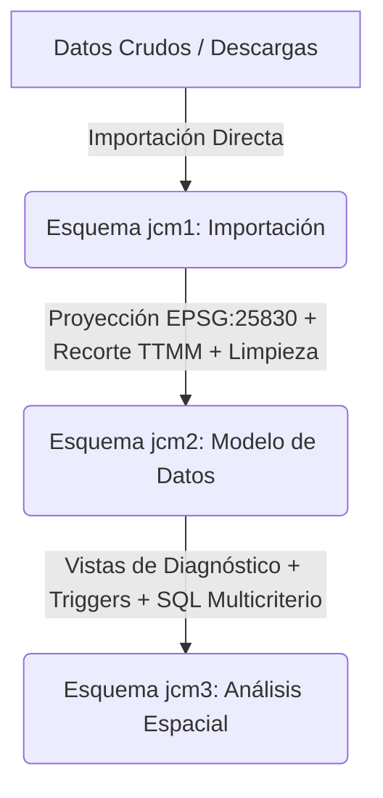

# Directivas y Política de Desarrollo SQL / PostGIS

Este documento establece las directrices de diseño, buenas prácticas y principios de lógica espacial que rigen el desarrollo del proyecto final de **Bases de Datos Espaciales (BDE)**. Su objetivo es garantizar la consistencia, la integridad topológica y la reproducibilidad de los datos municipales en PostgreSQL/PostGIS.

---

## 1. Reglas Generales del Repositorio y Arquitectura

### 1.1 Aislamiento Estricto del Código SQL (Regla 2)
Para mantener una separación clara de responsabilidades, **ninguna consulta SQL debe incrustarse como texto (hardcodeada) dentro de los scripts de Python**.
* **Mandatorio**: Todo script de base de datos, DDL, DML o consulta de validación debe residir en su propio archivo `.sql` individual.
* **Flujo de Ejecución**: El script de Python debe actuar únicamente como conector y ejecutor de dichos archivos mediante el uso de la biblioteca `psycopg2` y el lector de archivos de Python:
  ```python
  from pathlib import Path
  import psycopg2
  
  # Cargar el archivo SQL de forma segura
  sql_path = Path(__file__).parent / "procesar_jcm2.sql"
  query = sql_path.read_text(encoding="utf-8")
  
  # Conexión y ejecución
  conn = psycopg2.connect(...)
  with conn.cursor() as cur:
      cur.execute(query)
  conn.commit()
  ```

### 1.2 Parametrización y Configuración Centralizada (Regla 5)
Está prohibido hardcodear parámetros geográficos o administrativos (códigos de municipios, husos de proyección, buffers, etc.) tanto en Python como en SQL.
* Toda variable de configuración debe importarse desde [config.py](file:///c:/Users/bryan/Desktop/UPV/S2/1_Distribucion/BLOQUE1/Proyecto_Final/scripts/config.py).
* Las consultas en los archivos `.sql` deben parametrizarse usando placeholders estándar de SQL o ser reemplazadas dinámicamente mediante formateo controlado en Python antes de enviarse al motor de base de datos.

---

## 2. Ciclo de Vida e Integridad de los Esquemas

El proyecto organiza los datos en tres esquemas PostgreSQL diferenciados que representan fases consecutivas del flujo de procesamiento:



### 2.1 Esquema `jcm1` (Importación)
* **Objetivo**: Copia fiel de los datos descargados de las fuentes oficiales (Catastro, IGN, SIOSE).
* **Restricción**: Se mantiene el Sistema de Referencia Espacial (SRS) original de la descarga (generalmente geográficas EPSG:4258 para IGN, o el huso correspondiente) sin aplicar modificaciones, recortes ni correcciones geométricas. Actúa como capa de solo lectura.

### 2.2 Esquema `jcm2` (Modelo de Datos)
* **Homogeneización del SRS**: Toda la cartografía debe reproyectarse al sistema proyectado oficial del proyecto: **EPSG:25830** (UTM Huso 30N) para la península, garantizando mediciones lineales y de área métricas precisas.
* **Reducción de Dimensiones**: Conversión de geometrías 3D a 2D mediante la función `ST_Force2D`.
* **Recorte Espacial**: Los datos se recortan al término municipal en estudio (`ttmm`) o a su zona de amortiguación (buffer de 500m para prever vecindades) utilizando predicados como `ST_DWithin` o buffers espaciales en la unión de la consulta.
* **Validación Geométrica**: Solo se admiten geometrías válidas en las tablas de este esquema. Se debe comprobar la validez y corregir mediante:
  ```sql
  -- Identificar geometrías no válidas
  SELECT gid FROM jcm2.building WHERE NOT ST_IsValid(geom);
  
  -- Corrección proactiva antes de insertar
  UPDATE jcm2.building SET geom = ST_MakeValid(geom) WHERE NOT ST_IsValid(geom);
  ```
* **Restricciones DDL**: Aplicar restricciones semánticas rígidas (`NOT NULL`, `CHECK`, `UNIQUE`) y relaciones de claves foráneas para asegurar la coherencia de los atributos (p.ej., números de plantas no negativos en edificios).

### 2.3 Esquema `jcm3` (Análisis Espacial)
* **Diagnóstico Visual**: Creación de vistas espaciales de diagnóstico que identifiquen elementos conflictivos (solapes de parcelas, invasión de viales por edificios, etc.). Estas vistas se cargan en QGIS con estilos contrastados para su revisión manual.
* **Automatización**: Reglas de base de datos y Triggers que corrigen geometrías o actualizan atributos en tiempo real.

---

## 3. Estándar Simple Features y Gestión de Geometrías

PostGIS implementa el estándar *Simple Feature Access* de la OGC (ISO 19125). La lógica del proyecto debe respetar la jerarquía de herencia y las dimensiones espaciales de los objetos.

### 3.1 Dimensiones y Tipos de Datos
* **0D (Punto / multipunto)**: Representados por `Point` o `MultiPoint` (p.ej. portales, centros de masas).
* **1D (Curva / multilínea)**: Representados por `LineString` o `MultiLineString` (p.ej. tramos de viales, ríos).
* **2D (Superficie / multipolígono)**: Representados por `Polygon` o `MultiPolygon` (p.ej. edificios, parcelas, límites de términos municipales).

### 3.2 Coherencia Multipartes (Singlepart vs Multipart)
Al estructurar el DDL, las columnas geométricas deben declararse explícitamente con su tipo y SRID para optimizar el rendimiento y restringir la entrada de datos incompatibles:
```sql
-- DDL Correcto y tipado explícitamente
CREATE TABLE jcm2.nueva_capa (
    gid serial PRIMARY KEY,
    nombre varchar(100),
    geom geometry(MultiPolygon, 25830)
);
```

#### Reglas de Manipulación:
1. **Garantizar Tipo Multiparte**: Al insertar geometrías obtenidas de consultas o intersecciones en columnas definidas como `MultiPolygon` o `MultiLineString`, se debe usar `ST_Multi` para forzar que el tipo de datos sea multipartes, incluso si la consulta devuelve un elemento simple:
   ```sql
   INSERT INTO jcm2.nueva_capa (nombre, geom)
   SELECT nombre, ST_Multi(geom) FROM jcm1.capa_origen;
   ```
2. **Desagrupación (Explode)**: Para separar una geometría multiparte en sus componentes individuales simples, se debe utilizar `ST_Dump`, el cual devuelve una fila independiente por cada componente junto con una matriz de índice (`path`):
   ```sql
   -- Desagrupar un MultiPolygon en Polígonos simples
   SELECT gid, (ST_Dump(geom)).path[1] as idx, (ST_Dump(geom)).geom as geom_simple
   FROM jcm2.capa_multipartes;
   ```

---

## 4. Predicados y Relaciones Espaciales (Topología)

Las relaciones espaciales entre objetos geométricos se evalúan mediante predicados que devuelven un valor booleano (`true` o `false`).

### 4.1 Resumen de Predicados Estándar
* `ST_Equals(A, B)`: Las geometrías son espacialmente idénticas.
* `ST_Disjoint(A, B)`: No comparten ningún punto físico en común.
* `ST_Intersects(A, B)`: Comparten al menos un punto (opuesto de `ST_Disjoint`).
* `ST_Touches(A, B)`: Intersecan únicamente en sus límites (fronteras), nunca en sus interiores.
* `ST_Crosses(A, B)`: Su intersección resulta en una dimensión menor que la geometría máxima (p.ej. una línea que cruza un polígono).
* `ST_Within(A, B)`: El interior de A está completamente contenido en el interior de B.
* `ST_Contains(A, B)`: B está completamente contenido dentro de A (`ST_Within` a la inversa).
* `ST_Overlaps(A, B)`: Comparten parte del espacio geométrico de la misma dimensión, pero ninguno de los dos contiene al otro.

### 4.2 Relaciones Avanzadas con DE-9IM y `ST_Relate`
Cuando las relaciones estándar son insuficientes, se utiliza el modelo **DE-9IM** (Dimensionally Extended 9-Intersection Model), que compara la intersección de Interiores, Fronteras (Boundaries) y Exteriores de ambas geometrías.

* **Ejemplo Clave (Cruces Viales sin Nodos)**: Para encontrar carreteras que se cruzan en su interior (y que por lo tanto deberían tener un nodo compartido para enrutamiento, pero no lo tienen), se busca el patrón `'0********'` mediante `ST_Relate`. Esto indica que sus interiores intersecan en dimensión 0 (un punto), pero no comparten fronteras (extremos):
  ```sql
  -- Detectar intersecciones incorrectas entre viales
  SELECT tv1.gid, tv2.gid, ST_Intersection(tv1.geom, tv2.geom)
  FROM jcm2.tramovial tv1
  JOIN jcm2.tramovial tv2 ON ST_Intersects(tv1.geom, tv2.geom) AND tv1.gid < tv2.gid
  WHERE ST_Relate(tv1.geom, tv2.geom, '0********');
  ```

### 4.3 Buenas Prácticas de Sintaxis en Predicados
Dado que los predicados espaciales devuelven un tipo booleano nativo en PostgreSQL, se debe evitar la comparación explícita contra cadenas de texto en las cláusulas de filtro:
* **PROHIBIDO**: `WHERE ST_Intersects(a.geom, b.geom) = 'true'`
* **MANDATORIO**: `WHERE ST_Intersects(a.geom, b.geom)`

---

## 5. Operaciones y Concatenaciones Espaciales (Spatial Joins)

Las concatenaciones espaciales permiten acoplar registros de diferentes tablas basándose en su ubicación relativa en el espacio.

### 5.1 Estructura del Spatial Join
El acoplamiento se realiza en la cláusula `ON` utilizando un predicado espacial en lugar de una igualdad de clave primaria/foránea estándar:
```sql
SELECT e.gid, p.parcela
FROM jcm2.building e
JOIN jcm2.cadastralparcel p ON ST_Intersects(e.geom, p.geom);
```

### 5.2 Optimización de Rendimiento y Uso de Índices (Regla 3)
Las consultas espaciales pueden volverse lentas al evaluar combinaciones en tablas con miles de registros. Es crítico optimizarlas para que aprovechen los índices espaciales **GiST** (Generalized Search Tree).

* **El problema de `ST_Distance`**: Evaluar `ST_Distance(a.geom, b.geom) < 500` obliga a calcular la distancia matemática exacta para cada par de filas, forzando una búsqueda por fuerza bruta (Full Table Scan), ignorando los índices.
* **La solución con `ST_DWithin`**: Debe utilizarse `ST_DWithin(a.geom, b.geom, 500)`. Esta función evalúa primero si las cajas delimitadoras (Bounding Boxes) de las geometrías intersecan aplicando una tolerancia de 500 metros. Al apoyarse en la indexación por Bounding Boxes, se descartan instantáneamente el 99% de las parejas lejanas sin computar distancias exactas:
  ```sql
  -- Consulta Optimizada: Aprovecha el índice GiST
  SELECT count(*) 
  FROM jcm2.building b
  JOIN jcm2.ttmm m ON ST_DWithin(b.geom, m.geom, 500);
  ```

---

## 6. Operadores Constructivos y de Extracción

Los operadores espaciales permiten generar nuevas geometrías a partir de relaciones espaciales complejas.

### 6.1 Operadores de Superposición (Overlays)
* `ST_Intersection(A, B)`: Devuelve el espacio común compartido.
* `ST_Difference(A, B)`: Devuelve la parte de A que no es ocupada por B.
* `ST_Union(A, B)`: Fusiona ambas geometrías en un solo objeto espacial unificado.
* `ST_Buffer(geom, distancia)`: Crea una envolvente equidistante alrededor del objeto.

### 6.2 Extracción Segura de Geometrías (`STX_Extract` vs `ST_CollectionExtract`)
Al realizar operaciones de superposición (como `ST_Intersection` entre dos polígonos que se tocan tangencialmente), el resultado puede ser una colección mixta (`GeometryCollection`) conteniendo puntos (0D), líneas (1D) y polígonos (2D). 

Para almacenar estos resultados de forma homogénea en tablas temáticas, es necesario extraer únicamente la dimensión que nos interesa.
* **El problema de `ST_CollectionExtract`**: Si en la colección no existe ninguna geometría de la dimensión solicitada, la función nativa de PostGIS devuelve un objeto de tipo `EMPTY` (ej. `MULTIPOLYGON EMPTY`). Esto puede corromper las columnas geométricas estrictas o dificultar análisis espaciales posteriores.
* **La solución con el Wrapper `STX_Extract`**: En este proyecto se promueve el uso de la función personalizada `STX_Extract(geom, dimension)`. Si no hay geometrías de la dimensión especificada, devuelve `NULL`. Esto permite filtrar fácilmente los registros no válidos usando `WHERE geom IS NOT NULL`:
  ```sql
  -- Extracción segura de la parte poligonal (Dimensión 3) resultante de una intersección
  INSERT INTO jcm3.interseccion_suelos (geom)
  SELECT ST_Multi(STX_Extract(ST_Intersection(s.geom, t.geom), 3))
  FROM jcm2.suelos s
  JOIN jcm2.ttmm t ON ST_Intersects(s.geom, t.geom)
  WHERE STX_Extract(ST_Intersection(s.geom, t.geom), 3) IS NOT NULL;
  ```
  *(Nota de dimensiones: 1 = Point, 2 = LineString, 3 = Polygon)*

### 6.3 Funciones de Coordenadas y Construcción
* `ST_Centroid(geom)`: Calcula el centro de masas geométrico.
* `ST_MakePoint(x, y)`: Crea un punto a partir de coordenadas flotantes.
* `ST_SetSRID(geom, srid)`: Asigna una proyección espacial a una geometría sin transformar sus coordenadas físicas.
* `ST_Transform(geom, srid)`: Reproyecta las coordenadas de la geometría a un nuevo sistema de referencia espacial.
* `ST_X(geom)` / `ST_Y(geom)`: Extraen las coordenadas cartesianas de un objeto tipo Point.

---

## 7. Integridad y Automatización en el Servidor (Triggers)

Para evitar la microgestión y garantizar que la base de datos actúe como un escudo de calidad de datos, se deben programar salvaguardas de integridad referencial y geométrica directamente en el motor PostgreSQL.

### 7.1 Restricciones DDL a nivel de Tabla
Se deben definir restricciones semánticas rígidas directamente al crear las tablas:
```sql
CREATE TABLE jcm2.building (
    gid serial PRIMARY KEY,
    value varchar(50) NOT NULL,
    superficie_m2 double precision,
    geom geometry(Polygon, 25830),
    -- Restricción: No se admiten geometrías corruptas
    CONSTRAINT check_valid_geom CHECK (ST_IsValid(geom)),
    -- Restricción: Evitar valores negativos en atributos
    CONSTRAINT check_positive_area CHECK (superficie_m2 >= 0)
);
```

### 7.2 Actualización de Atributos mediante Triggers (Automatización)
En lugar de depender de cálculos realizados por el cliente SIG o por Python, los atributos derivados (como áreas o longitudes) deben actualizarse automáticamente en cada inserción o modificación:

```sql
-- 1. Crear la función del trigger
CREATE OR REPLACE FUNCTION jcm2.fnc_actualizar_area()
RETURNS trigger AS $$
BEGIN
    NEW.superficie_m2 := ST_Area(NEW.geom);
    RETURN NEW;
END;
$$ LANGUAGE plpgsql;

-- 2. Vincular el trigger a la tabla
CREATE TRIGGER trg_actualizar_area
    BEFORE INSERT OR UPDATE ON jcm2.building
    FOR EACH ROW
    EXECUTE FUNCTION jcm2.fnc_actualizar_area();
```

### 7.3 Bloqueo Preventivo de Inconsistencias Topológicas
Se pueden usar disparadores de excepción para bloquear activamente transacciones que introduzcan errores espaciales intolerables (por ejemplo, evitar que se guarde un edificio que solapa físicamente con otro preexistente):

```sql
CREATE OR REPLACE FUNCTION jcm2.fnc_validar_solapes()
RETURNS trigger AS $$
DECLARE
    solape_detectado boolean;
BEGIN
    -- Comprobar si solapa con algún edificio existente en más de 1 m²
    SELECT EXISTS (
        SELECT 1 
        FROM jcm2.building b
        WHERE b.gid <> COALESCE(NEW.gid, -1)
          AND ST_Overlaps(NEW.geom, b.geom)
          AND ST_Area(ST_Intersection(NEW.geom, b.geom)) > 1.0
    ) INTO solape_detectado;
    
    IF solape_detectado THEN
        RAISE EXCEPTION 'Operación cancelada: La geometría solapa con un edificio existente en más de 1.0 m²';
    END IF;
    
    RETURN NEW;
END;
$$ LANGUAGE plpgsql;

CREATE TRIGGER trg_validar_solapes
    BEFORE INSERT OR UPDATE ON jcm2.building
    FOR EACH ROW
    EXECUTE FUNCTION jcm2.fnc_validar_solapes();
```
